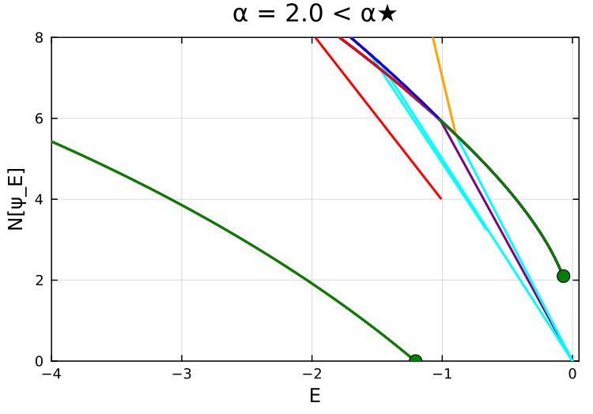
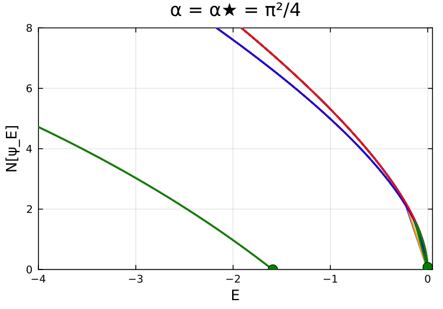
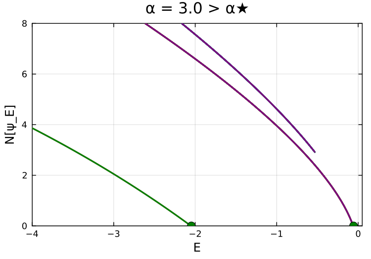

# NLSBifurcations.jl

Numerical code for **"Resonance-induced nonlinear bound states"**  
*J. C. Turner and M. I. Weinstein, Nonlinearity (2026)*  
DOI: [10.1088/1361-6544/ae9de1](https://doi.org/10.1088/1361-6544/ae9de1)

---

## Bifurcation diagrams

Nonlinear bound state branches $\mathcal{N}[\psi_E]$ vs $E$ for the symmetric square well $V(x) = -\alpha\,\chi_{[-1,1]}(x)$ at three depths relative to the threshold $\alpha_\star = \pi^2/4$:

| $\alpha < \alpha_\star$ | $\alpha = \alpha_\star$ | $\alpha > \alpha_\star$ |
|:---:|:---:|:---:|
|  |  |  |

Green markers: bifurcation energies predicted by the linear scattering data. Branches arising from **scattering resonance poles** exhibit a strictly positive $L^2$ threshold; branches from **bound state poles** start at $\mathcal{N} = 0$.

---

## Installation

```julia
using Pkg
Pkg.add(url="https://github.com/jacktrnr/NLS-Resonance-Bifurcations")
```

Or clone and activate locally:

```bash
git clone https://github.com/jacktrnr/NLS-Resonance-Bifurcations.git
cd NLS-Resonance-Bifurcations
julia --project=. -e 'using Pkg; Pkg.instantiate()'
```

## Quick start

```julia
using NLSBifurcations

# Define a potential
a, b = -1.0, 1.0
Vfun = square_well(a, b, -2.0)

# Compute scattering data (poles and transmission zeros)
scat = compute_all_scattering_data(a, b, Vfun; N=500, k_max=4.0)
print_scattering_summary(scat)

# Find nonlinear bound state branches
seeds = find_all_seeds(a, b, Vfun; E_list=[-0.5, -1.0], ζmax=10.0, nscan=4000)
branches = continue_from_seeds(seeds, a, b, Vfun; N=5000, p_min=-4.0)

# Or use the scattering data to discover all branches automatically
branches, scat = find_all_branches_from_scattering(a, b, Vfun)
```

### Paper potential (eq 5.1)

```julia
# Symmetric (Figure 7): β = 0
V = paper_potential(3.0, 0.0)

# Asymmetric (Figure 10): β = -11
V = paper_potential(24.0, -11.0)

# Find threshold depth
α_star = find_threshold_alpha_qep(0.0)  # symmetric case
```

## Reproducing paper results

Scripts in `examples/` map directly to the paper:

| Script | Paper result |
|--------|-------------|
| `examples/table1.jl` | Table 1 — threshold resonance asymptotics |
| `examples/figure9.jl` | Figure 9 — square well bifurcation diagrams |
| `examples/figure9_scattering.jl` | Figure 9 left panels — scattering data |

```bash
julia --project=. examples/figure9.jl
```

## Package structure

```
src/
  NLSBifurcations.jl   Main module
  potentials.jl         15+ compactly supported potentials + paper_potential(α,β)
  scattering.jl         QEP for w(k) and s₋(k) zeros (ghost-point FD + companion)
  shooting.jl           ODE integration with ζ-parametrization
  continuation.jl       Seed finding + BifurcationKit PALC + scattering-informed discovery
  glue.jl               Soliton tail matching
  spectral.jl           L₊/L₋ stability operators
  dynamics.jl           Split-step time evolution
  plots.jl              Visualization

examples/              Paper reproduction scripts
halfline/              Half-line code (Dirichlet BC, used for Table 1)
docs/figures/          Generated figures
```

## Methods

**Scattering data** — The eigenvalue problems for $w(k) = 0$ (outgoing BCs: $\psi'(a) = -ik\psi(a)$, $\psi'(b) = ik\psi(b)$) and $s_-(k) = 0$ (transmission BCs: $\psi'(a) = ik\psi(a)$, $\psi'(b) = ik\psi(b)$) are discretized on $[a,b]$ with ghost-point elimination, yielding quadratic eigenvalue problems $(A + ikB)\psi = k^2\psi$ linearized to $2N \times 2N$ companion matrices.

**Nonlinear continuation** — Bound states are found by shooting through the potential with the $\zeta$-parametrized initial amplitude $c = \sqrt{-2E}\tanh\zeta$, matching to soliton tails via the Hamiltonian residual. Branches are continued in $E$ using pseudo-arclength continuation ([BifurcationKit.jl](https://github.com/bifurcationkit/BifurcationKit.jl)).

**Verification** — Theorem 4.4 predictions ($E(\varepsilon)/\varepsilon \to -\frac{1}{2}U_\star(b)^2$, $x_R(\varepsilon) \to$ finite limit) are confirmed numerically in `examples/table1.jl`.

## License

MIT

## Citation

```bibtex
@article{TurnerWeinstein2026,
  author  = {Turner, Jackson C and Weinstein, Michael I},
  title   = {Resonance-induced nonlinear bound states},
  journal = {Nonlinearity},
  year    = {2026},
  doi     = {10.1088/1361-6544/ae9de1}
}
```
