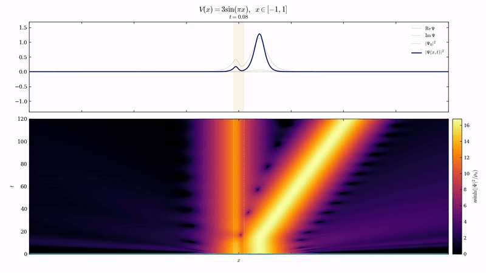
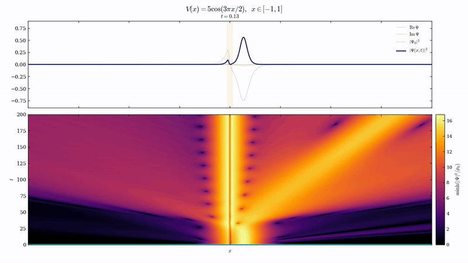

# NLSBifurcations.jl

Companion code for

> **Resonance-induced nonlinear bound states**
> J. C. Turner and M. I. Weinstein, *Nonlinearity* (2026)
> DOI: [10.1088/1361-6544/ae9de1](https://doi.org/10.1088/1361-6544/ae9de1)

> **Sharp stability conditions of resonance-induced nonlinear bound states**
> J. C. Turner and M. I. Weinstein, 2026

A Julia toolkit for the focusing 1D cubic NLS/GP equation $i\partial_t\Psi = -\partial_x^2\Psi + V(x)\Psi - |\Psi|^2\Psi$ with a compactly supported potential $V$: bifurcation analysis of nonlinear bound states seeded by scattering resonances, transmission resonances, and bound state poles of $H_V = -\partial_x^2 + V$, plus spectral stability diagnostics and long-time dynamics.

---

## Demos

Long-time evolution of two unstable transmission-resonance-induced bound states. Top: $|\Psi(x,t)|^2$ profile. Bottom: rescaled spacetime density $\mathrm{asinh}(|\Psi|^2/\rho_0)$.



*$V(x) = 3\sin(\pi x)$ on $[-1,1]$. The bifurcated state ejects a soliton and the inner core relaxes onto the stable $E_0$ branch.*



*$V(x) = 5\cos(3\pi x/2)$ on $[-1,1]$. Sign-changing core; the inner state settles on the coexisting $E_1$ branch with slow radiation.*

Higher-quality MP4s are in `videos/`.

---

## Installation

```julia
using Pkg
Pkg.add(url="https://github.com/jacktrnr/NLS-Resonance-Bifurcations")
```

Or clone and activate locally:

```bash
git clone https://github.com/jacktrnr/NLS-Resonance-Bifurcations.git
cd NLS-Resonance-Bifurcations
julia --project=. -e 'using Pkg; Pkg.instantiate()'
```

## Quick start

```julia
using NLSBifurcations

a, b = -1.0, 1.0
Vfun = square_well(a, b, -2.0)

# Linear scattering data (bound poles, resonance poles, transmission zeros)
scat = compute_all_scattering_data(a, b, Vfun; N=500, k_max=4.0)

# Complete nonlinear branches (automatic fold recovery)
branches = trace_complete_branches(a, b, Vfun;
    E_list=[-0.3, -0.8, -1.3], p_min=-4.0)
```

## Reproducing paper results

### Resonance-induced nonlinear bound states (Nonlinearity)

| Script | Paper result |
|--------|-------------|
| `examples/table1.jl` | Table 1 -- threshold asymptotics |
| `examples/figure9.jl` | Figure 9 -- square well bifurcation diagrams |
| `examples/figure9_complete.jl` | Figure 9(a) -- full branch topology |

### Sharp stability conditions (arXiv)

| Script | Paper result |
|--------|-------------|
| `paper_figures/generate_paper_figures.jl` | Figures 6.1, 6.2, 6.4 |
| `paper_figures/generate_stable_transmission_figures.jl` | Figure 6.3 |
| `paper_figures/resim_and_plot_prof3.jl` | Figures 7.1, 7.2 |

```bash
julia --project=. examples/table1.jl
julia --project=. examples/04_custom_V_full_pipeline.jl
```

## Methods

**Scattering data** -- Discretize $-\psi'' + V\psi = k^2\psi$ on $[a,b]$ with ghost-point elimination of the Robin BCs ($\psi' = \pm ik\psi$). Outgoing BCs give zeros of $w(k)$; transmission BCs give zeros of $s_-(k)$. Both yield QEPs $(A + ikB)\psi = k^2\psi$, linearized to $2N \times 2N$ companion matrices.

**Nonlinear continuation** -- Bound states are found by shooting with the $\zeta$-parametrized initial amplitude, matching to soliton tails via the Hamiltonian residual. Branches are continued in $E$ using PALC (BifurcationKit.jl). When the continuation stalls at a fold, the code automatically searches for seeds nearby and continues past it.

**Stability** -- The linearized operators $L_+$, $L_-$ are analyzed via Evans function matching (Jost solutions + Poeschl-Teller reference) and finite-difference eigenvalue computation. The full $\mathcal{JL}$ Evans function determines spectral stability of the nonlinear bound states.

**Dynamics** -- Split-step Fourier with DST-I kinetic propagator and optional complex absorbing potential at the boundaries.

## Package structure

```
src/
  NLSBifurcations.jl   Main module
  scattering.jl         QEP for w(k) and s₋(k) zeros
  potentials.jl         Compactly supported potentials + paper_potential(α,β)
  continuation.jl       Seed finding, PALC, fold recovery
  shooting.jl           ODE integration
  glue.jl               Soliton tail matching
  spectral.jl           L₊/L₋ finite-difference eigenvalues
  lplus.jl              Evans function matching for L₊
  jl_evans.jl           JL Evans function for full linearization
  wells.jl              Potentials from the stability paper
  dynamics.jl           Split-step time evolution

examples/              Runnable demos and paper reproduction
paper_figures/         Scripts reproducing every figure in the stability paper
data/                  Pre-computed branch data for figure reproduction
videos/                Animations of unstable dynamics
halfline/              Half-line code (Dirichlet BC, Table 1)
test/                  Package tests
```

## License

MIT

## Citation

```bibtex
@article{TurnerWeinstein2026,
  author  = {Turner, Jackson C and Weinstein, Michael I},
  title   = {Resonance-induced nonlinear bound states},
  journal = {Nonlinearity},
  year    = {2026},
  doi     = {10.1088/1361-6544/ae9de1}
}

@article{TurnerWeinstein2026Stability,
  author  = {Turner, Jackson C and Weinstein, Michael I},
  title   = {Sharp stability conditions of resonance-induced nonlinear bound states},
  year    = {2026}
}
```
